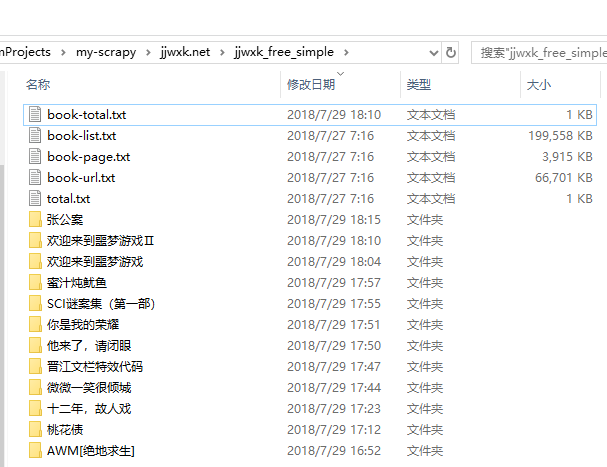
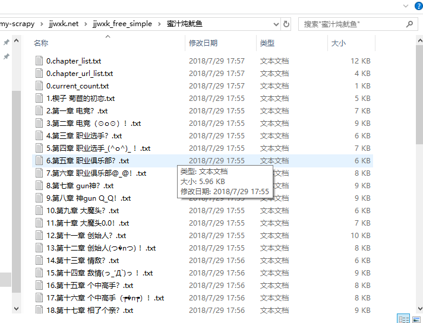

## 前情提要

最近想学习学习怎么写小说，爬点资源分析分析

## 晋江文学库

免费小说爬取

1. 简单模式
2. HTML静态模式
3. Sqlite模式
4. ES模式
5. ES+ECHARTS模式

### 简单模式

运行方法：进入到当前目录下 

```
python jjwxk-free-simple.py
```

1. 简单模式是以文本文件作为数据媒介，存储格式用文件夹实现层次，每个子文件夹一本小说数据
2. 所有小说列表和小说具体内容爬取步骤分离，可以分两个线程运行 free_list 和 book_list 方法，每个方法不支持多进程运行
3. 实现了简单的断点续爬，利用文本文件记录爬取进度，包括小说列表进度、已完成的小说进度、当前这本小说章节进度

部分截图：





>PS：本项目仅学习分享用，请不要用于商业